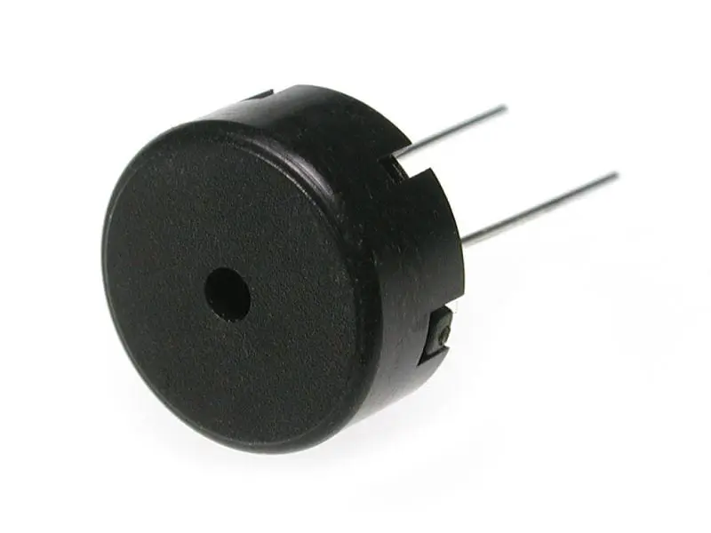
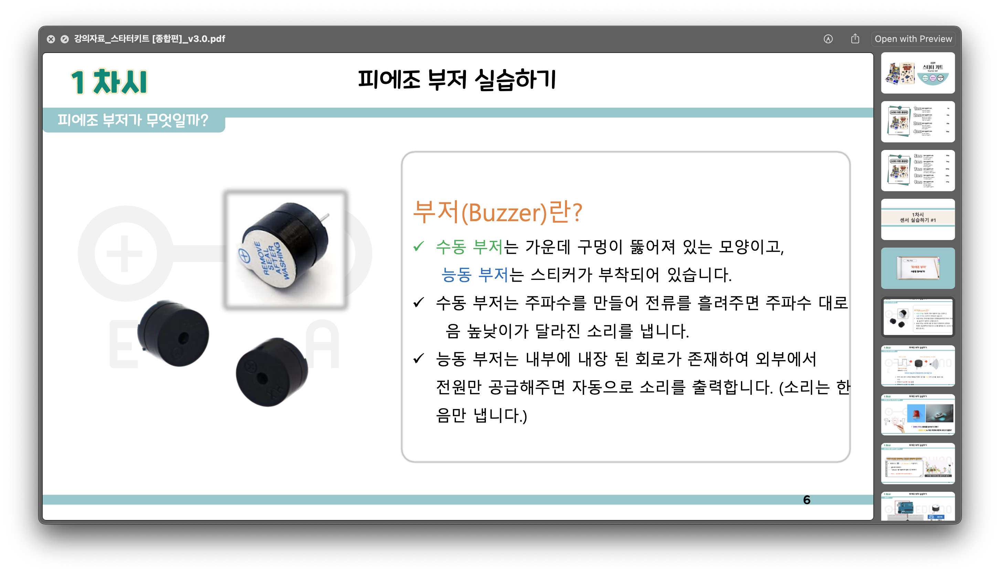
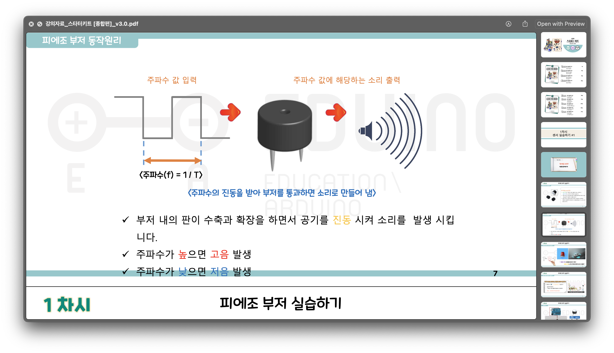
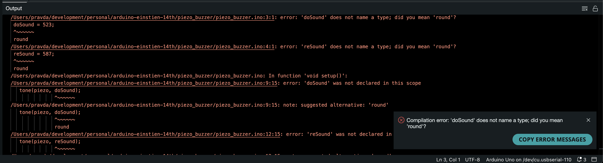

# Piezo Buzzer - Basic

# 시작하기 전



- 이 부품은 어떤 역할을 하는 부품일까? 부품만 보고 뭘 하는지 생각해보자.

---

# 어떻게 이렇게 작동할 수 있을까?

- 영상에서 뭔가 컴퓨터로 실행을 했더니 갑자기 저기서 소리가 났다. 어떻게 소리가 난 걸까? 그리고 ‘도레미파솔라시도’ 로 들린다.
  - 당연히 저 영상만 보고 이 질문에 대답할 수는 없다. 힌트를 줄 건데, 이 힌트를 보고 대답할 수도 없다. 그냥 생각을 해 보는 시간이다.

## 힌트

- 결국 컴퓨터는 사람이 명령한 대로 행동한다.
- 저번 블루투스 시간에 주파수가 큰 소리가 더 높은 소리가 나는 걸 기억해보자.

---

# 이 부품은 어떻게 돌아가는 걸까?

## 한 눈에 원리 파악해보기





- 코드에 나온대로 주파수를 만들어 전류를 흘려준다.
- 전류가 버저(buzzer, 여기선 ‘부저’) 내의 자석에 전기를 흘려 버저 내부의 판을 움직인다.
- 이전에 같이 봤던 영상처럼, 판이 움직이면서 소리가 만들어진다.

# 어떤 명령이 들어갔을까?

```arduino
void setup() {
  pinMode(11, OUTPUT);

	// 도
  tone(11, 523);
  delay(1000);

	// 레
  tone(11, 587);
  delay(1000);

	// 미
  tone(11, 659);
  delay(1000);

	// 파
  tone(11, 698);
  delay(1000);

	// 솔
  tone(11, 784);
  delay(1000);

	// 라
  tone(11, 880);
  delay(1000);

	// 시
  tone(11, 988);
  delay(1000);

	// 도
  tone(11, 1046);
  delay(1000);

  noTone(11);
}

void loop() {
}
```

- 아두이노에게 이런 명령이 내려진다.
  - 사람이 봤을 때 뭔지 잘 모르는 명령이지만, 사실 이건 사람이 봤을 때 이해하기 쉬운 명령어이다.
  - 즉, 사람이 아두이노와 같은 기계에게 좀 더 편하게 명령하기 위해 만든 언어다.
- 기계는 이걸 바로 읽을 수는 없고, 기계가 좀 더 이걸 이해하기 쉽게 중간에 번역을 한 번 거친다.

## 우리가 보지 못 하는, 기계에게 명령을 내리는 과정들

```bash
Using board 'uno' from platform in folder: /Users/pravda/Library/Arduino15/packages/arduino/hardware/avr/1.8.6
Using core 'arduino' from platform in folder: /Users/pravda/Library/Arduino15/packages/arduino/hardware/avr/1.8.6
Detecting libraries used...
/Users/pravda/Library/Arduino15/packages/arduino/tools/avr-gcc/7.3.0-atmel3.6.1-arduino7/bin/avr-g++ -c -g -Os -w -std=gnu++11 -fpermissive -fno-exceptions -ffunction-sections -fdata-sections -fno-threadsafe-statics -Wno-error=narrowing -flto -w -x c++ -E -CC -mmcu=atmega328p -DF_CPU=16000000L -DARDUINO=10607 -DARDUINO_AVR_UNO -DARDUINO_ARCH_AVR -I/Users/pravda/Library/Arduino15/packages/arduino/hardware/avr/1.8.6/cores/arduino -I/Users/pravda/Library/Arduino15/packages/arduino/hardware/avr/1.8.6/variants/standard /private/var/folders/d2/f7hz3s8s5zvbgrcxgt9840g00000gn/T/arduino-sketch-9B27318E6CF01BC500B170C62656C805/sketch/piezo_buzzer.ino.cpp -o /dev/null
Generating function prototypes...
/Users/pravda/Library/Arduino15/packages/arduino/tools/avr-gcc/7.3.0-atmel3.6.1-arduino7/bin/avr-g++ -c -g -Os -w -std=gnu++11 -fpermissive -fno-exceptions -ffunction-sections -fdata-sections -fno-threadsafe-statics -Wno-error=narrowing -flto -w -x c++ -E -CC -mmcu=atmega328p -DF_CPU=16000000L -DARDUINO=10607 -DARDUINO_AVR_UNO -DARDUINO_ARCH_AVR -I/Users/pravda/Library/Arduino15/packages/arduino/hardware/avr/1.8.6/cores/arduino -I/Users/pravda/Library/Arduino15/packages/arduino/hardware/avr/1.8.6/variants/standard /private/var/folders/d2/f7hz3s8s5zvbgrcxgt9840g00000gn/T/arduino-sketch-9B27318E6CF01BC500B170C62656C805/sketch/piezo_buzzer.ino.cpp -o /private/var/folders/d2/f7hz3s8s5zvbgrcxgt9840g00000gn/T/arduino-sketch-9B27318E6CF01BC500B170C62656C805/preproc/ctags_target_for_gcc_minus_e.cpp
/Users/pravda/Library/Arduino15/packages/builtin/tools/ctags/5.8-arduino11/ctags -u --language-force=c++ -f - --c++-kinds=svpf --fields=KSTtzns --line-directives /private/var/folders/d2/f7hz3s8s5zvbgrcxgt9840g00000gn/T/arduino-sketch-9B27318E6CF01BC500B170C62656C805/preproc/ctags_target_for_gcc_minus_e.cpp
Compiling sketch...
/Users/pravda/Library/Arduino15/packages/arduino/tools/avr-gcc/7.3.0-atmel3.6.1-arduino7/bin/avr-g++ -c -g -Os -w -std=gnu++11 -fpermissive -fno-exceptions -ffunction-sections -fdata-sections -fno-threadsafe-statics -Wno-error=narrowing -MMD -flto -mmcu=atmega328p -DF_CPU=16000000L -DARDUINO=10607 -DARDUINO_AVR_UNO -DARDUINO_ARCH_AVR -I/Users/pravda/Library/Arduino15/packages/arduino/hardware/avr/1.8.6/cores/arduino -I/Users/pravda/Library/Arduino15/packages/arduino/hardware/avr/1.8.6/variants/standard /private/var/folders/d2/f7hz3s8s5zvbgrcxgt9840g00000gn/T/arduino-sketch-9B27318E6CF01BC500B170C62656C805/sketch/piezo_buzzer.ino.cpp -o /private/var/folders/d2/f7hz3s8s5zvbgrcxgt9840g00000gn/T/arduino-sketch-9B27318E6CF01BC500B170C62656C805/sketch/piezo_buzzer.ino.cpp.o
Compiling libraries...
Compiling core...
Using precompiled core: /private/var/folders/d2/f7hz3s8s5zvbgrcxgt9840g00000gn/T/arduino-core-cache/core_arduino_avr_uno_17546f4d3c717ba9a51b95fed5c3110d.a
Linking everything together...
/Users/pravda/Library/Arduino15/packages/arduino/tools/avr-gcc/7.3.0-atmel3.6.1-arduino7/bin/avr-gcc -w -Os -g -flto -fuse-linker-plugin -Wl,--gc-sections -mmcu=atmega328p -o /private/var/folders/d2/f7hz3s8s5zvbgrcxgt9840g00000gn/T/arduino-sketch-9B27318E6CF01BC500B170C62656C805/piezo_buzzer.ino.elf /private/var/folders/d2/f7hz3s8s5zvbgrcxgt9840g00000gn/T/arduino-sketch-9B27318E6CF01BC500B170C62656C805/sketch/piezo_buzzer.ino.cpp.o /private/var/folders/d2/f7hz3s8s5zvbgrcxgt9840g00000gn/T/arduino-sketch-9B27318E6CF01BC500B170C62656C805/../arduino-core-cache/core_arduino_avr_uno_17546f4d3c717ba9a51b95fed5c3110d.a -L/private/var/folders/d2/f7hz3s8s5zvbgrcxgt9840g00000gn/T/arduino-sketch-9B27318E6CF01BC500B170C62656C805 -lm
/Users/pravda/Library/Arduino15/packages/arduino/tools/avr-gcc/7.3.0-atmel3.6.1-arduino7/bin/avr-objcopy -O ihex -j .eeprom --set-section-flags=.eeprom=alloc,load --no-change-warnings --change-section-lma .eeprom=0 /private/var/folders/d2/f7hz3s8s5zvbgrcxgt9840g00000gn/T/arduino-sketch-9B27318E6CF01BC500B170C62656C805/piezo_buzzer.ino.elf /private/var/folders/d2/f7hz3s8s5zvbgrcxgt9840g00000gn/T/arduino-sketch-9B27318E6CF01BC500B170C62656C805/piezo_buzzer.ino.eep
/Users/pravda/Library/Arduino15/packages/arduino/tools/avr-gcc/7.3.0-atmel3.6.1-arduino7/bin/avr-objcopy -O ihex -R .eeprom /private/var/folders/d2/f7hz3s8s5zvbgrcxgt9840g00000gn/T/arduino-sketch-9B27318E6CF01BC500B170C62656C805/piezo_buzzer.ino.elf /private/var/folders/d2/f7hz3s8s5zvbgrcxgt9840g00000gn/T/arduino-sketch-9B27318E6CF01BC500B170C62656C805/piezo_buzzer.ino.hex

/Users/pravda/Library/Arduino15/packages/arduino/tools/avr-gcc/7.3.0-atmel3.6.1-arduino7/bin/avr-size -A /private/var/folders/d2/f7hz3s8s5zvbgrcxgt9840g00000gn/T/arduino-sketch-9B27318E6CF01BC500B170C62656C805/piezo_buzzer.ino.elf
Sketch uses 2046 bytes (6%) of program storage space. Maximum is 32256 bytes.
Global variables use 28 bytes (1%) of dynamic memory, leaving 2020 bytes for local variables. Maximum is 2048 bytes.
```

- 위에 나와있는 명령(앞으론 이걸 ‘코드’ 라고 하자)을 컴퓨터가 이해하기 쉽게 하기 위해 위의 과정들을 거친다. 되게 다양한 영어들이 나오는데, 이건 코딩을 하기 위해 처음에 설치했던 환경에서 이것저것 끌어다 쓰고, 컴퓨터에 설치된 것들도 끌어다 쓰는 과정이다.

```bash
@@^A&µ¨<9b>^EÀ/?^Yð^A<96>¡^]±^]?¿º/©/<98>/<88>'¼^AÍ^Ab^Oq^]<81>^]<91>^]Bàf^Ow^_<88>^_<99>^_J<95>Ñ÷^H<95><8f><92><9f><92>¯<92>¿<92>Ï<92>ß<92>ï<92>ÿ<92>^N<94>¼^AK^A\^A<88>îÈ.<83>àØ.á,ñ,^N<94>¼^Ah^Yy<8a><9b>h>s@<81>^E<91>^E¨ó!àÂ^ZÑ^Há^Hñ^H<88>î<88>^N<83>à<98>^^¡^\±^\Á^TÑ^Dá^Dñ^D)÷ÿ<90>ï<90>ß<90>Ï<90>¿<90>¯<90><9f><90><8f><90>^H<95><90><91>^@^A<89>^S^MÀìçðàä<91><9f>ï<90><93>^@^Aá0 ô1Àhñâ0 ô3À<90>àü^AèYÿO$<91>ü^AëUÿO4<91>ü^AïVÿOä<91>î#Ñð"#Qð#0  ô:Àxõ!0 ô<À"0   ô=Àðàî^Oÿ^_ãXÿO¥<91>´<91><8f>·ø<94>ì<91>0<95>>#<<93><8f>¿^H<95>^P<92>n^@ÓÏ<90><91>o^@<9d>^?<90><93>o^@ÍÏ<90><91>p^@<9d>^?<90><93>p^@<91>à<90><93>°^@<90><91>±^@<98>^?<94>`<90><93>±^@^P<92>³^@¼Ï'0©ð(0Éð$0<89>ö<80><91><80>^@<8f>}^CÀ<80><91><80>^@<8f>w<80><93><80>^@ÇÏ<84>µ<8f>w<84>½ÃÏ<84>µ<8f>}ûÏ<80><91>°^@<8f>w<80><93>°^@ºÏ<80><91>°^@<8f>}ùÏ^_<92>^O<92>^O¶^O<92>^Q$/<93>?<93><8f><93><9f><93>¯<93>¿<93><80><91>^C^A<90><91>^D^A <91>^E^A°<91>^F^A0<91>^B^A#à#^O-7Xõ^A<96>¡^]±^] <93>^B^A<80><93>^C^A<90><93>^D^A <93>^E^A°<93>^F^A<80><91>^G^A<90><91>^H^A <91>^A°<91>^A^A<96>¡^]±^]<80><93>^G^A<90><93>^H^A<93>^A°<93>@
```

- 그리고 이 결과를 거쳐 만들어진, 번역이 끝난 코드는 이런 모습이다.

## 요즘 세상의 프로그래밍 언어

```jsx
const stats = require("stats-analysis");
const config = require("lighthouse/lighthouse-core/config/perf-config");
const spawn = require("child_process").spawn;
const os = require("os");

const timesToRun = 10;

function wait(val) {
  return new Promise((resolve) => setTimeout(resolve, val));
}
```

- 여러분들이 보는 [페이스북과 인스타그램을 만드는 데 쓰이는 도구](https://github.com/facebook/react/blob/main/scripts/bench/benchmark.js)를 만든 코드 중 일부분이다. 아두이노 코드에 사용된 언어보다 더 나중에 나온 언어로 만들어진 코드이다.
- 보면 알 수 있듯이 프로그래밍 언어는 위에 적은 아두이노에게 명령을 내리는 코드보다 훨씬 더 사람이 읽기 쉬워지는 방향으로 발전하고 있다. 그만큼 그 언어를 해석해서 컴퓨터에게 직접 명령을 내리는 역할을 맡은 프로그램이 더 똑똑해 진다는 이야기라고도 할 수 있고.

---

# 좀 더 읽기 쉽게 코딩해보자

## 저 코드를 봤을 때 드는 느낌

- [위에 있는 코드](https://www.notion.so/Piezo-Buzzer-Basic-27c87038757645f6b917cd2cac65fdd8)를 다시 한 번 보자. 도레미파솔라시도 (랑 비슷한…) 소리를 피에조 부저를 통해 내는 코드이다.
- 그런데 저 코드를 봤을 때, 한 눈에 알아볼 수 있을까?

```jsx
void setup() {
  pinMode(11, OUTPUT);

  tone(11, 523);
  delay(1000);

  tone(11, 587);
  delay(1000);
	// ...
}
```

- 사실 `pinMode` 가 뭔지도 모르겠다. `OUTPUT` 은 또 무슨 말일까?
  - [arduino pinMode API](https://www.google.com/search?q=arduino+pinMode+API&rlz=1C5CHFA_enKR990KR990&oq=arduino+pinMode+API+&aqs=chrome..69i57j33i160l4.4257j0j7&sourceid=chrome&ie=UTF-8) 라고 구글에 검색하면 [arduino 에서 이게 뭔지 설명해 준 웹 페이지 문서](https://cdn.arduino.cc/reference/en/language/functions/digital-io/pinmode/)를 찾을 수 있다. 무슨 내용인지 이야기해보자.
  - arduino 에서 `pinMode()` 가 무엇인지 설명한 내용 요약 (expand)
    > Configures the specified pin to behave either as an input or an output. See the [Digital Pins](http://arduino.cc/en/Tutorial/DigitalPins) page for details on the functionality of the pins. - [Arduino](https://cdn.arduino.cc/reference/en/language/functions/digital-io/pinmode/)
    - 특정 pin 을 input 혹은 output 으로 사용하겠다고 설정하는 역할을 한다. `pinMode(pinNumber, mode)` 와 같은 방식으로 호출할 수 있으며, `pinNumber` 의 pin 을 `INPUT`, `OUTPUT`, 혹은 `INPUT_PULLUP` 중 하나로 사용하겠다는 이야기이다.
- 그 뒤에는 숫자들이 막 이어진다. `tone` 이라는 것 옆에 괄호가 붙어있고, 괄호에 두 개의 숫자가 `(11, 523)` 와 같이 들어간다.
  - `523` 은 “도”, `587` 은 “레” 다.

### 소감을 말 해 주세요

- 읽었을 때 어떤 느낌이 드는가?

## 쉽게 만들려면?

### 와닿지 않으니 사람이 하고 듣는 말로 바꿔보자

- 저것도 위에 말했던 것처럼 언어다. 저 코드의 느낌을 일상 속에서 주고 받는 대화로 바꿔보자면, 이렇다.

```
mentee_00 아!

	내가 너 주머니에 10,000원 넣어줄게. 하나로마트에 가서

	--

	하나로마트 안에 있는 101에 가서, 주머니에 1,000원을 꺼내
  1,000원 어치 고기를 사와

	-

	1초동안 숨 한 번 크게 들이쉬고 내쉬어

	--

  하나로마트 안에 있는 102에 가서, 주머니에서 2,000원을 꺼내
  2,000원 어치 채소를 사와

	-

	1초동안 숨 한번 크게 들이쉬고 내쉬어

	...
```

- 이 대사를 들었을 때 재영이의 심정이, 코딩하는 사람들이 [이 코드](https://www.notion.so/Piezo-Buzzer-Basic-27c87038757645f6b917cd2cac65fdd8) 를 볼 때 드는 심정과 비슷하다. “왜 저렇게 쓸 데 없이 말을 많이 하지?”

### 이 말을 좀 더 깔끔하게 바꿔보자

```
거기 = 하나로마트

mentee_00 아!

 	내가 너 주머니에 10,000원 넣어줄게. {거기}에 가서

	--

	{거기} 안에 있는 101에 가서, 주머니에 1,000원을 꺼내
  1,000원 어치 고기를 사와

	-

	1초동안 숨 한 번 크게 들이쉬고 내쉬어

	--

	{거기} 안에 있는 102에 가서, 주머니에서 2,000원을 꺼내
  2,000원 어치 채소를 사와

	-

	1초동안 숨 한번 크게 들이쉬고 내쉬어

	...
```

- 먼저 없앨 수 있는 것들 중 반복되는 걸 간단하게 만들어보자. “하나로마트” 라는 말이 계속 반복된다. 이미 어디에 있는 가게들인지 아는데, 굳이 다 써야할까?
- 한 번 말한 내용을 “여기”, “거기” 라는 식으로 줄여 말하는 걸 생각해보면서, 하나로마트를 “여기”, “거기” 로 바꿔보자.

```
거기 = 하나로마트
고기파는곳 = 101
채소파는곳 = 102

mentee_00 아!

 	내가 너 주머니에 10,000원 넣어줄게. {거기}에 가서

	--

	{거기} 안에 있는 {고기파는곳}에 가서, 주머니에 1,000원을 꺼내
  1,000원 어치 고기를 사와

	-

	1초동안 숨 한 번 크게 들이쉬고 내쉬어

	--

	{거기} 안에 있는 {채소파는곳}에 가서, 주머니에서 2,000원을 꺼내
  2,000원 어치 채소를 사와

	-

	1초동안 숨 한번 크게 들이쉬고 내쉬어

	...
```

- 그 다음엔 101, 102 라는 번호를 사람이 이해하기 쉬운 걸로 바꾸어보자. 101은 고기를 사는 곳이니 고기파는곳 일것이고, 102는 채소를 사는 곳이니 채소파는곳일 것이다.
  - 101은 고기파는곳, 102는 채소파는곳 이라고 놓고 이걸 사람이 이해하기 쉽게 101과 102에 넣어보자.
- 숨 쉬는 거, 얼마를 써서 뭘 사라는 건 더 줄이기가 어렵다. 숨을 안 쉬면 사람이 죽고, 얼마어치의 뭔가를 사라는 걸 이야기하지 못 하면 그건 심부름이 아니다.

### 그걸 코드로 옮겨보자

```arduino
pin = 11;

doSound = 523;
reSound = 587;
miSound = 659;
faSound = 698;
solSound = 784;
raSound = 880;
tiSound = 988;
higherDoSound = 1046;

void setup() {
	// pinMode(11, OUTPUT); ->
  pinMode(pin, OUTPUT);

	// tone(pin, 523); ->
  tone(pin, doSound);
  delay(1000);

  tone(pin, reSound);
  delay(1000);
	// ...
}
```

- 이런 코드를 사람이 이해하기 쉽게 다시 쓰려면, 어떻게 해야할까?

  - 내가 다시 써 본 코드 (expand)

    ```arduino
    piezo = 11;

    doSound = 523;
    reSound = 587;

    void setup() {
      pinMode(piezo, OUTPUT);

      tone(piezo, doSound);
      delay(1000);

      tone(piezo, reSound);
      delay(1000);
    	// ...
    }
    ```

- 그러면 이렇게 더 간단하게 만든 코드를 아두이노에게 넘겨보자. 어떤 일이 벌어질까?
  - 이런 일이 벌어진다
    
- 왜 이런 일이 벌어지는걸까? 한 번 이야기해보자.
  - mentee_00: 컴퓨터는 우리가 하는 말들을 이해할 수가 없었기 때문이다.
  - mentee_01: 컴퓨터가 표현할 수 없었기 때문이다.
  - mentee_02: 영어로 통일되지 않고 한국어를 써서, 그러니까 컴퓨터 안에서 한국어를 영어로 바꾸는 기능이 없기 때문이다. 또, 코드를 넘길 때 아두이노가 센서에게 신호를 보내는 과정 속에 음 코드는 숫자로만 해야하기 때문이다.
  - mentee_03: 컴퓨터는 한국어를 이해하지 못 하고, 한국어로 말을 하는 우리들도 컴퓨터를 이해할 수 없었기 때문에. 서로 의사소통이 안 되었다.
  - mentee_04: 한국어를 인식하지 못 해서.

### 다른 그릇들


- 밥을 담는 그릇은 밥그릇, 국을 담는 그릇은 국그릇, 생선구이나 제육볶음을 담는 그릇은 앞에 있는 큰 그릇이다.
- 컴퓨터도 위에 적은 것처럼 뭔가를 어디에 저장할 때, 담는 내용에 따라 달라지는 그릇처럼 어떤 게 담길 지 그릇 앞에 적어줘야 한다.

```arduino
int pin = 11;

int doSound = 523;
int reSound = 587;

void setup() {
  pinMode(piezo, OUTPUT);

  tone(piezo, doSound);
  delay(1000);

  tone(piezo, reSound);
  delay(1000);
	// ...
}
```

- 수학 시간에 배웠던 ‘정수’ 를 기억해보자. 1, 2, 3, 혹은 -1, -2, -3 같이 깔끔하게 떨어지는 걸 정수라고 부른다.
- 이 정수는 영어로 `integer` 라고 부르는데, 이걸 다 쓰기 귀찮으니 앞의 3글자인 `int` 만을 따온다.
- 그래서 `pin = 11;` 라는 가장 첫 줄에서 오류가 났던 이유는 어떤 게 담길지를 정확하게 적어주지 않았기 때문이고, 이 문제를 해결하기 위해선 `pin` 라는 그릇에 정수(`integer`, `int`)가 담긴다는 것을 컴퓨터도 알 수 있게 적어주어야 한다.
- piezo 뿐만 아니라 `doSound`, `reSound` 도 결국 담기는 것은 숫자이니 앞에 `int` 가 붙는 것이다.

## 쉽게 만들어 보기 + @

| 역할                       | 이름          | 담기는 종류 | 담기는 내용 |
| -------------------------- | ------------- | ----------- | ----------- |
| 피에조 버저의 위치         | piezo         | int         | 11          |
| 도 소리를 내는 주파수      | doSound       | int         | 523         |
| 레 소리를 내는 주파수      | reSound       | int         | 587         |
| 미 소리를 내는 주파수      | miSound       | int         | 659         |
| 파 소리를 내는 주파수      | faSound       | int         | 698         |
| 솔 소리를 내는 주파수      | solSound      | int         | 784         |
| 라 소리를 내는 주파수      | raSound       | int         | 880         |
| 시 소리를 내는 주파수      | tiSound       | int         | 988         |
| 다음 도 소리를 내는 주파수 | higherDoSound | int         | 1046        |

- 이제 도와 레 만 하는게 아니라, 위에 적힌 표를 참고해서 도레미파솔라시도~ 소리를 나게 만들어보자.

  - 내가 다시 간단하게 쓴 코드, 최종본

    ```arduino
    int piezo = 11;

    int doSound = 523;
    int reSound = 587;
    int miSound = 659;
    int faSound = 698;
    int solSound = 784;
    int raSound = 880;
    int tiSound = 988;

    int higherDoSound = 1046;

    void setup() {
      pinMode(piezo, OUTPUT);

      // 5옥타브-도
      tone(piezo, doSound);
      delay(1000);

      // 레
      tone(piezo, reSound);
      delay(1000);

      // 미
      tone(piezo, miSound);
      delay(1000);

      // 파
      tone(piezo, faSound);
      delay(1000);

      // 솔
      tone(piezo, solSound);
      delay(1000);

      // 라
      tone(piezo, raSound);
      delay(1000);

      // 시
      tone(piezo, tiSound);
      delay(1000);

      // 6옥타브-도
      tone(piezo, higherDoSound);
      delay(1000);

      noTone(piezo);
    }
    ```

  ***
