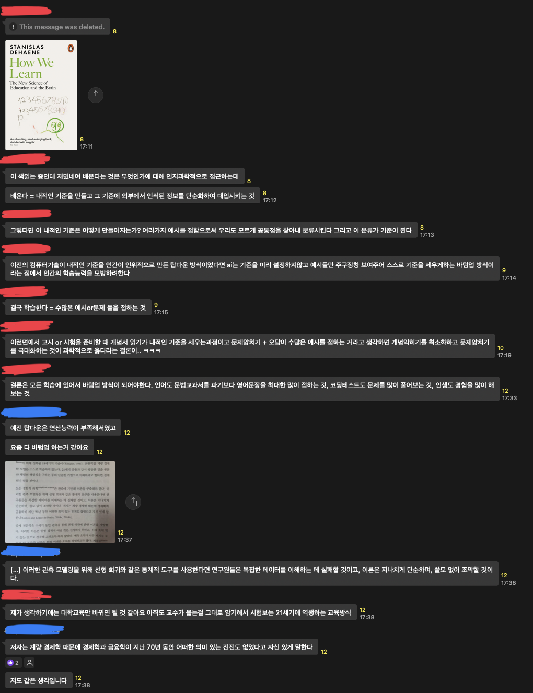

# TIL ~2023/02/11

## 시범강의 피드백

- 시범강의에 대한 결과가 왔다. 강의력 자체는 더 할 나위 없이 훌륭했는데, 아무래도 초심자들을 대상으로 설명하는 강의인데 초보자의 눈높이에 맞지 않았다는 피드백을 들었다.
- 그래서 이번 강의 대신 나중에 있을 같은 주제의 라이브 강의를 진행하게 되었고, 오늘의 피드백을 통해 내 스스로를 돌아보는 계기가 되었다.
- 일단은 웹 개발 과정을 듣는 사람들이라고 가정했던 것이 첫 번째 간과한 점인 듯 하다. 웹 개발 과정을 IoT 프로젝트를 하기 전에 배우고 왔다고 한들 국비교육의 특성 상 코딩 자체를 거의 처음 배우는 분들이 많았을텐데 내가 이 점을 간과하고 있었단 점을 생각하면서 깨달을 수 있었다.
- 생각해보면 나도 프로그래밍을 처음에 열심히 배울 때, 사실 뭐가 뭔지도 몰랐었다. 비동기와 동기는 무엇인지, endpoint 는 무엇인지, TCP connection 은 무엇인지 등. 그때의 내 모습을 나는 까먹은 걸까, 지식의 저주에 걸린 건 아닐까 싶기도 하다.

## 또 다른 배움

> 수업이 마음에 들지 않으면 선생님과 말도 하지 않고, 고개를 끄덕끄덕, 도리도리 하면서 의사소통을 하는 친구였죠. 아이에게 흥미를 불어넣기 위해, 가장 먼저 간단하지만 예쁜 회로를 함께 만들어 보았습니다. 회로에 전원을 넣으니 아이는 감동을 받은 표정으로 제게 말했습니다. "선생님, 너무 예뻐요." - [친구가 블로그에 쓴 글](<(https://m.blog.naver.com/PostView.naver?blogId=dlgus0828&logNo=223011904709&navType=by)>)

- 월성에서 내려가 멘토링을 할 때 시간투자를 좀 많이 해 가면서 "어떻게 하면 아이들에게 더 좋은 경험을 줄 수 있을까?" 라는 고민을 참 많이 했고, 고민한 만큼 여러 시도를 하면서 뿌듯한 순간도 좀 있었다. 그 경험을 친구가 글에 참 잘 써 줘서 인용을 해 봤다.

> 초등학생을 가르칠 때는 아이의 흥미가 최우선입니다. 선생님이 억지로 끌고 가도, 모두 티가 나더라고요. - [친구가 블로그에 쓴 글](<(https://m.blog.naver.com/PostView.naver?blogId=dlgus0828&logNo=223011904709&navType=by)>)

- 이것도 마찬가지로 친구가 글을 참 잘 써서 인용을 한 부분이다. 물론 나는 지금 취업을 진지하게 목표로 하는 사람들을 대상으로 한 강의를 촬영하고 있는 중이라 상황이 다를 수 있다만, 그럼에도 배울 수 있는 점이 자명하게 존재한다고 생각이 들었다.

> 법에 혹시 관심이 있는 친구가 있다면 법의 조항과 판레를 보여주는 게 아니라, 당장 재판 방청 신청을 해서 거기서 그 법이 어떤 식으로 기능하는 지를 보여줄 거에요. - 친구와의 대화에서

- 이건 글은 아니고, 그 친구가 오늘 이 글을 쓰고 보여주면서 이야기 한 내용 중 인상깊었어서 정리해봤다.

- 또 친구들이 모여있는 방에서 인지과학측면에서 배움에 대한 이야기도 나왔었는데, 이것도 보고 느낀 점이 많았다.

## 결론

- 결론을 내리자면, "내가 뭔가를 배우거나 뭔가를 가르칠 때 아래와 같은 방식으로 수행해보면 어떨까?" 라는 생각을 했다.
  - 일단 환경을 구성한 뒤 돌아가는 걸 손으로 실행해본다.
  - 거기서 여러 번 실패도 해 보고, 조금씩 수정해서 다른 방법으로도 구동해본다.
  - 이제 그 흥미를 안고, codeline 을 보면서 어떤 식으로 구성이 되었는지 하나하나 확인해본다.
  - 그걸 통해 잘게 나뉘어진 새로운 목표를 수행해본다.

## 여담

- 이제 한 달 동안 내려가 있다가 친구들을 만나는 일정들은 어느정도 다 소화를 했고, 프로그래밍 외로 부수적으로 해야 하는 행정성 업무들도 90% 정도 처리가 완료되었다. 이제 내 자신 스스로를 마주하고 거기에 집중할 때가 온 듯 하다. 학사 졸업을 위해 다시 학교로 돌아온 만큼 2023, 2024년까진 열심히 그리고 재미있게 공부 해봐야지. 내일은 친구를 만나고 놀면서 집 앞 카페에 가서 차 한잔 하며 2023년의 로드맵을 세워봐야겠다.
